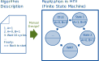

# noRTL

Finite state machines (FSMs) are the key building blocks for realizing control logic in digital systems.
A procedural code or sequence of steps is mapped to a set of states, transitions and operations that are to be performed in each state.
Common hardware description languages (HDL) like VHDL and (System)Verilog provide methods to model these automata on Register Transfer Level (RTL) with the help of large case-statements that describe what is done in each state and if a transition to a next state should be performed.
Provided that only synthesizeable language constructs are used, the description can be implemented into a hardware circuit.
In addition, coverage analysis tools may track state transitions if (and only if) a certain coding style is used.



The challenge of these descriptions lies in the way of creating and maintaining the code.
In most cases, we see that the design process starts with a flow chart or pseudo code of a control algorithm with timing annotations on a cycle-accurate level.
The designer then partitions this sequence of steps into individual states that are then characterized by their transitions and outputs.
Finally, the code is created and tested in a testbench -- and normally reiterated since some intermediate states have to be inserted or if a step in the algorithm has to be changed.
The seemingly simple act of inserting a new state in VHDL or Verilog requires at least three modifications of the code at different positions: The new state must be added, typically to an enumeration of states. Then, the transition from the previous states to the new state must be added. Finally, the state itself with its functionality, as well as out-bound transitions must be implemented.
This is a result of RTL level descriptions since they only allow to model the assignments to existing registers and do not support adapting the register sizes after declaration to introduce new states.
This adaption needs to be done manually with the inherent constraint that the register size should be fixed at the end of the RTL design process.

As a result, the implementation and maintenance of sequential control with more than a few states is a laborious process.
Even if the HDLs support the modeling of sequential behavior without explicit description of states, these constructs like static delays are not synthesizeable.
Further, the realization of more advanced concepts like hierarchical state machines may be synthesizeable but break coverage extraction and are therefore less used in favor of a clean verification method.

## Why getting away from RTL descriptions?

"RTL [...] is a design abstraction which models a synchronous digital circuit in terms of the flow of digital signals (data) between hardware registers, and the logical operations performed on those signals." (https://en.wikipedia.org/wiki/Register-transfer_level)

RTL requires the designer to...

* Define the state registers (mostly before defining states)
* Define state encodings
* Define register assignments in each state

Current design languages do this in different code sections. Each

## Why not SystemC and/or HLS?

There is no real SystemC synthesizer and HLS requires the tedious task to statically analyze C code.
Python is simple, readable, accessible and the community is bigger (and you get a lot of addons that you can use to play with).

## Workflow

Python code generates a data structure that represents the engine.
This data structure is the rendered into verilog.

## Zen of noRTL

```
States are never defined before they are used
Explicit state naming is never required
Glue code should be abstracted
Coverage is a good idea
```
