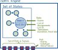

# Data Model

The key to understanding noRTL lies in recognizing how its data structures are designed to enable seamless translation from high-level state machine descriptions to hardware description language (HDL) code. This section elaborates on the architectural decisions behind the data model.

## Representation of a Engine

A noRTL engine consists of a set of states and a set of IOs. Each state has a list of assigns and a list of transitions. This is rather conventional. The new idea of this tool is that these lists can be modified *on the fly*, i.e. during the runtime of the python code.



The Python code can be seen as a sort of generator language: The code itself is used to assemble the internal data structure of the engine. The engine object itself provides functions like `engine.sync()` or `engine.jump_if()` that create a new state and a (possibly conditional) transition to this state. The python code is itself assumed to run single-threaded while the generated engine may exhibit parallel behavior. This simplifies the handling of parallel running sub-engines in the final code.

After this data structure has been assembled, it can be converted (i.e. rendered) into Verilog code or other representations.

In this way, an *a priory* declaration can be omitted. Also, signals can be defined at any position in the code. The explanations below are therefore given for reference. Ideally, a user will not be bothered with these details.

### The Single Source of Truth Principle

The entire data model embodies the **single source of truth** principle. Every aspect of the state machine (states, transitions, assignments, signal definitions) is defined once in the `CoreFSFM` structure and then used to generate all outputs. This eliminates the risk of having to manually update multiple files when a state machine design changes — a common problem in traditional RTL development.

For example, when adding a new state:

* The state is added to `engine.states`
* Transitions to/from the new state are defined
* Assignments for the new state are configured

Following, the renderers (e.g. VerilogRenderer) may produce the final result from this base.

This approach dramatically reduces cognitive load on the designer and minimizes errors that typically occur when manually updating multiple code locations for a single state machine change.

### CoreEngine: The Central Orchestrator

The `CoreEngine` object serves as the central container for the entire state machine, but its role extends far beyond simple storage. It is designed as a **code generation blueprint** that coordinates all components for output to HDL. This design choice embodies the critical principle of **single source of truth** for the state machine description.

#### State Management

The `engine.states` collection is not merely a list -- it's the *only* source of truth for all states. This design ensures that any modification (adding, removing, or changing states) is reflected consistently across all generated code. When a new state is added via `engine.add_state("NEW_STATE")`, the state immediately becomes available for transition definition and assignment configuration. This eliminates the need for manual synchronization across multiple files, which is a common source of errors in traditional RTL development.

#### Signal Management

  - define_local: ...
  - define_input. ...
  - define_output: ...

#### Instances

- **Instances**: ...


### States: Execution Units with Built-in Logic

States in noRTL are not just named entities—they are full execution units with their own logic. Each `State` object contains:

- **Assignments**: These define what outputs should be set in the state, directly mapping to Verilog assignments. For example:
  ```python
  state.assign('output_signal', 1)
  ```
  becomes:
  ```verilog
  output_signal <= 1;
  ```
  in Verilog. This preserves the exact value and signal name while maintaining a clean high-level interface.

- **Transitions**: Each state maintains a list of possible transitions with associated conditions.


### Metadata for Objects


### The `Renderable` Concept

The `Renderable` interface (not explicitly shown in the provided code but implied by the structure) is critical for the data model's flexibility. It allows different components (like signals, states, assignments) to be converted to their HDL representation consistently. For example, the `Signal` class implements a `render()` method that returns the appropriate Verilog representation.

This concept enables the system to handle complex expressions and signals uniformly, whether they're simple assignments or nested structures.
